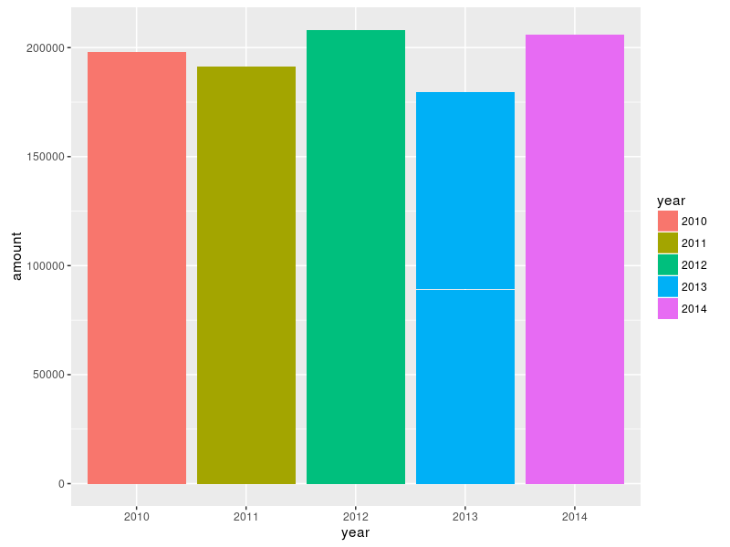

+++
category = "science"
title = "Beginners Guide to  Creating Grouped and Stacked Bar Charts in R With ggplot2"
date = "2016-09-09"
tags = ["r", "r-lang", "chart", "plot", "bar", "barchart", "tutorial", "guide", "statistics", "science"]
path = "blog/science/beginners-guide-to-creating-grouped-and-stacked-bar-charts-in-r-with-ggplot2"

[extra]
id = "e3b1e6dd-8520-425e-8afe-aca23e71ba28"

+++

<summary>
  This tutorial will give you a step by step guide to creating grouped and stacked
  bar charts in R with ggplot2.  
  We start with a very simple bar chart, and enhance it to end up with a stacked 
  and grouped bar chart with a proper title and cutom labels.
</summary>

[R-Lang](https://www.r-project.org/) is a programming language and environment
for doing all kinds of statistical analysis, and if you are interested in 
statistics, you've probably heard about it already.

R is free, open source, and has a huge range of packages available to do pretty 
much everything you'd ever want to do in this field: loading, transforming and 
analyzing data. And generate pretty charts and graphs. It has become a popular
alternative to expensive solutions like [SPSS](http://www.ibm.com/analytics/us/en/technology/spss/).

I took me a while to figure out how to create a bar chart with stacked bars, 
that are grouped by a certain value.

To make it easier, for you, I'll give a little introduction to bar charts in R,
starting with a basic bar chart, then stacking the bars, and finally arriving
at a grouped and stacked bar chart with a chart title and better labels, which 
we will save to a file.


__Please note__ that this is not intended as a complete introduction to R itself.
There are plenty of tutorials out there for that.
<br /><br />

### Install and Launch R 

If you don't have R installed already, look for one tutorial for your platform,
or check out the [official guide](https://cran.r-project.org/doc/manuals/r-release/R-admin.html).

Then, launch the interactive R shell with the command `R`.
<br /><br />

### Install ggplot2

While R has plotting functions built in, the [ggplot2](http://ggplot2.org/)
library offers far superior capabilities and prettier results.

We have to install it seperatly, which is really easy, though.

Just execute these commands in the R shell:

```R
# Install.
install.package(ggplot2)
# Load ggplot2.
library(ggplot2)
```
<br />

### Getting some sample data

R has a couple of datasets built in, but for simplicity, we'll just generate 
our own data.

We will work with a simple dataset, which we create randomly: 
*Customer data for a fictional company, including the year, continent, gender and 
amount each __individual customer__ spent.

```R
d <- data.frame(
  year=factor(sample(2010:2014, 400, replace=T)), 
  continent=factor(sample(c("EU", "US", "Asia"), 400, replace=T)),
  gender=factor(sample(c("male", "female"), 400, replace=T)),
  amount=sample(20:5000, 400, replace=T)
)

```

The data looks like this:

<table class="table">
  <thead>
    <tr>
      <th>year</th>
      <th>continent</th>
      <th>gender</th>
      <th>amount</th>
    </tr>
  </thead>
  <tbody>
    <tr>
      <td>2010</td>
      <td>US</td>
      <td>male</td>
      <td>213</td>
    </tr>
    <tr>
      <td>2011</td>
      <td>EU</td>
      <td>female</td>
      <td>3433</td>
    </tr>
    <tr>
      <td>2014</td>
      <td>Asia</td>
      <td>male</td>
      <td>213</td>
    </tr>
    <tr>
      <td>...</td>
    </tr>
  </tbody>
</table>
<br />

### A simple plot: Customers per Year

Let's start of with a simple chart, showing the number of customers per year:

ggplot2 works in layers. First, you call the [ggplot()](http://docs.ggplot2.org/current/ggplot.html) 
function with default settings which will be passed down.

Then you add the layers you want by simply adding them with the __+ operator__.

For bar charts, we will need the [geom_bar()](http://docs.ggplot2.org/current/geom_bar.html) function.

The chart should just *pop up in a new window* when executing the command.

```R
ggplot(data=d, aes(x=year, y=amount)) + geom_bar(stat="identity")
```


__Note that the height of the bars will be different for you, because the sample
dataset contains random values__.

Alright, but we would like to have some colors for the bars. Let's make it pretty!  
All we need is to add a `fill` argument to `aes`


```R
ggplot(data=d, aes(x=year, y=amount, fill=year)) + geom_bar(stat="identity")
```

<br /><br />


### Stacked Bars: Customers per Year and Gender

Next step: split the bars into male / female customers.  
All we need to do is the change `fill` to the variable we want to stack by. 
In this case, it's *gender*.

```R
ggplot(data=d, aes(x=year, y=amount, fill=gender)) + geom_bar(stat="identity")
```


__Huh? That looks weird! *What happened?*__

Well, the data is displayed as is, unsorted, and so we get inter-dispersed "male" 
and "female" values.

To fix it, we have to __sort the data__ with the `order` function:


```R
# Sort the data first:
d <- with(d, d[order(year, gender),])
ggplot(data=d, aes(x=year, y=amount, fill=gender)) + geom_bar(stat="identity")
```


Ahh, there we go. Much better!
<br /><br />

### Grouped and Stacked Bars

Alright, almost there. Now we want to show data for each continent in a separate 
bar and group them by year.  
Turns out this is just another function call away. We need to use
[facet_grid](http://docs.ggplot2.org/0.9.3.1/facet_grid.html).

We change the __x axis to show the continent__ rather then the year.
Then we __group into years with facet_grid__.

```R
# Sort data.
d <- with(d, d[order(year, gender, continent),])
ggplot(data=d, aes(x=continent, y=amount, fill=gender)) + 
  geom_bar(stat="identity") + 
  facet_grid(~year)
```


Bingo, that's what we wanted.
<br /><br />

### Finishing Up: Chart Title and Labels

To finish it up, we want a nice big __chart title__ and better __labels__ for the axis 
and the legend on the right.

For this we need the [labs](http://docs.ggplot2.org/0.9.3.1/facet_grid.html)
function. For increasing the font size and adding some margins around the title, 
we use  [theme](http://docs.ggplot2.org/0.9.3.1/theme.html) to customize the rendering.

```R
ggplot(data=d, aes(x=continent, y=amount, fill=gender)) + 
  geom_bar(stat="identity") +
  facet_grid(~year) + 
  labs(title="Customer Analysis 2010-2014", x="", y="$ Spent / Year", fill="Gender") + 
  theme(plot.title = element_text(size=25, margin=margin(t=20, b=20)))
```


Pretty decent result. Especially considering how easy it was.
<br /><br />

### Saving our chart to a file

We have the perfect chart now and want to save it to a file.

[ggsave](http://docs.ggplot2.org/0.9.3.1/ggsave.html) makes this really easy:

```R
# Save the plot to a variable
p <- ggplot(...) ...
# Save to file.
# Size will be 800*600 pixels.
ggsave(p, file="chart.png", width=8, height=6, dpi=100)
```
<br />

### Conclusion

As you can see, it's pretty straight-forward to create good looking, complex
charts in R with just a few commands, thanks to the amazing libraries people
have built on top of R.

ggplot2 has plenty more chart types on offer. Just start browsing the 
[ggplot2 documentation](http://docs.ggplot2.org/current/) to explore.

If you liked this tutorial, comment, share, and watch out for future 
tutorials and posts on R on this blog.
<br /><br />

### References

* R project page: [http://r-project.org](http://r-project.org)
* ggplot2: [http://ggplot2.org](http://ggplot2.org/)
* ggplot2 documentation: [http://docs.ggplot2.org/current/](http://docs.ggplot2.org/current/)
* Sorting data with order: [http://rprogramming.net/r-order-to-sort-data](http://rprogramming.net/r-order-to-sort-data/)
